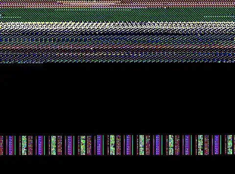

# rl

Reinforcement learning experiments on [PufferLib](https://github.com/PufferAI/PufferLib) 5.0, in Rust and C, including an agent that speedruns a star in the real Super Mario 64.

<p align="center">
  <a href="demos/peach-slide/star-674-touch.mp4">
    
  </a>
</p>

The result so far, above: the under-21-seconds star of Peach's Secret Slide in **674 frames (22.5 s)** from the course's start to touching the star, by a route training found on its own. Ten seconds in, it jumps off the upper track and free-falls 6,750 units onto the lower one. Click it for the [full-quality video](demos/peach-slide/star-674-touch.mp4). The inputs, traces and earlier records are in [`demos/peach-slide/`](demos/peach-slide/).

Three things live here:

- **A trainer** (`src/`). PufferLib 5.0's CUDA trainer, ported to Rust on [wgpu](https://wgpu.rs), so it runs on whatever GPU the machine has: Metal, Vulkan or DX12. No CUDA, no Python, no autograd. Every forward and backward pass is a WGSL compute kernel.
- **A platformer** (`envs/platformer/`). A small 2D platformer written as a PufferLib C env. It trains to the flag in 45 seconds and is the trainer's smoke test.
- **Super Mario 64** (`envs/sm64/`). The real cartridge as an environment. [N64Bundler](https://github.com/bigmah/n64bundler) statically recompiles your ROM to native code, one copy of the game runs per agent, and the task is to get one named star as fast as possible.

## Quick start

You need Rust ([rustup](https://rustup.rs)) and a C compiler. Everything else (the submodules, raylib, N64Bundler, the recompiled game) is fetched and built by the first `make` target that needs it. `make setup` does the fetching and the trainer's build up front if you'd rather.

**macOS**

```sh
brew install libomp          # OpenMP, which Apple's clang doesn't ship
brew install cmake ninja     # sm64 only
```

sm64 also needs Xcode, whose Metal toolchain compiles the renderer's shaders. Xcode 26 downloads it separately (`xcodebuild -downloadComponent MetalToolchain`), and the build says so if it's missing.

**Linux** (Debian and Ubuntu names)

```sh
sudo apt install build-essential clang cmake ninja-build git curl python3 libsdl2-dev \
    libx11-dev libxrandr-dev libxinerama-dev libxcursor-dev libxi-dev libgl-dev
```

### The platformer

```sh
make play     # play it yourself: A/D move, W/Space jump, S drop through platforms, R restart
make train    # train on the GPU; checkpoints go to checkpoints/platformer/
make eval     # watch the most trained checkpoint
make test     # the trainer's tests
```

### Super Mario 64

The one thing this needs from you is your own dump of the cartridge, Super Mario 64 (USA). Put it at `sm64.z64` in the top of the checkout, or point `SM64_ROM` at it. `build.sh` checks that it is that exact dump (game id `NSME`, ROM hash `8a90daa33e09a265`), because the env reads Mario out of memory at the addresses that cartridge uses. No game data goes into git: the ROM is read where it is, and everything derived from it lands in the gitignored `build/`.

```sh
cp ~/roms/sm64.z64 .
make sm64-train               # train on the star sm64.ini names (pss-2), 8 games at once
make sm64-watch               # watch that star's latest checkpoint play, in a window
make sm64-replay              # watch the fastest run to it on file
make sm64-train STAR=wf-1     # any other star: Whomp's Fortress's first
```

The first sm64 build takes a few minutes to build N64Bundler, and about twenty seconds to recompile the game. Every build after that finds both done.

Pass trainer flags with `ARGS`, e.g. `make train ARGS="--train.total-timesteps 10_000_000"`, and pick the env for the generic targets with `ENV=sm64`.

## Layout

```
src/                  the trainer; src/kernels/ holds its WGSL compute kernels
tests/                kernels against the CPU, acting against training, golden numbers
examples/             GPU benchmarks (make bench)
vecenv.c              PufferLib 5.0's CPU vecenv, compiled around each env
build.sh              builds an env into build/vecenv_<env>.dylib (.so on Linux)
envs/platformer/      platformer.h (the env), platformer.c (human play), platformer.ini
envs/sm64/            sm64.h (the env), n64b_gym.h (the game process), sm64.c (sm64_tool),
                      sm64.ini, stars/<star>.ini
demos/peach-slide/    the record runs: inputs, route traces, videos, notes
vendor/PufferLib      submodule, branch 5.0
vendor/n64bundler     submodule
```

`build/`, `target/`, `checkpoints/`, `logs/` and ROMs are gitignored.

## The trainer

PufferLib 5.0 trains with one CUDA program (`pufferl.cu` and `algo.cu`), which only an NVIDIA card runs. `src/` is that trainer on wgpu, with each kernel written once in WGSL.

```sh
cargo build --release
./target/release/pufferl train platformer [--train.total-timesteps 20_000_000 ...]
./target/release/pufferl eval platformer [latest | path/to/checkpoint.bin] [--headless]
```

**What it trains** is 5.0's:

- **Policy.** PufferLib's default: a bias-free Linear encoder, a 4-layer MinGRU with hidden size 128, and one decoder matrix whose last row is the value head. If the env's config names a `picture_width` and `picture_height`, the tail of the observation is an RGB picture, and the Nature DQN's three convolutions go in front of the encoder.
- **PPO as 5.0 has it.** Each minibatch computes advantages from its own values before the update (GAE, or V-trace with `vtrace = 1`) and doesn't normalize them. Minibatches are whole agent rows, with no prioritized replay. The MinGRU's state carries across horizons and clears where an episode ends.
- **Muon**, on the clipped gradient.

**Envs** are PufferLib 5.0 C envs. `build.sh` compiles `vecenv.c` around one into a shared library of its own, and the trainer loads it (`src/vecenv.rs`). The env steps on CPU threads and the policy runs on the GPU.

**Config** works as in 5.0. Values are read in this order, later over earlier:

1. `vendor/PufferLib/config/default.ini`
2. `envs/<env>/<env>.ini`
3. each `--config FILE`, in order
4. `--section.key=value` flags (a space works as well as `=`, and dashes in a key are underscores)

A `--config` file or a flag can only set a key an earlier config already has, so a misspelt key is an error rather than a setting nobody reads. `--config` is this repo's addition: a variant of an env, like one of sm64's stars.

**Output.** Checkpoints go to `checkpoints/<env>/<run_id>/<agent step>.bin`. When a run ends it writes `logs/<env>/<run_id>.ini`, which holds the config and a downsampled `[metrics]` section. `latest` is the checkpoint with the most agent steps, not the newest file. `eval` shows one env in a window, or with `--headless` plays `eval_episodes` episodes and prints the score.

Checkpoints are in 5.0's format, flat float32 weights in the CUDA trainer's order and padding, so PufferLib's own CPU eval (`puffercpu.c`) reads what this writes. Checkpoints from this repo's earlier 4.0 port (numpy `.npz` data under the same `.bin` names) still load.

**Additions to 5.0**, all off unless a config asks. The keys aren't in PufferLib's `default.ini`, so an env's ini has to define one before a flag can set it, as `sm64.ini` does:

| key in `[train]` | what it does |
|---|---|
| `norm_adv` | normalize each minibatch's advantages, as PufferLib 4.0 did |
| `weight_decay` | keeps Muon's weights bounded while there's no reward to learn from |
| `target_entropy`, `ent_coef_rate` | hold entropy at a target by moving `ent_coef`, instead of paying a fixed price |
| `ent_coef_damping` | adds the entropy gap itself to the coefficient, which stops the controller cycling once a run scores often |

**Not ported:** continuous actions, action masks, multiple GPUs, self-play and sweeps. Rollouts are always synchronous, so 5.0's `async = 1` is ignored.

### How it's built

wgpu runs compute shaders and nothing else: no BLAS, no tensors, no gradients. `algo.cu` has no autograd either. It is about 35 CUDA kernels with their backward passes written out, plus cuBLAS. This has the same shape, with one matmul kernel in place of cuBLAS:

- `matmul.wgsl`: each thread computes a 4×4 block of the result, and a long inner dimension is cut into chunks that run side by side and are summed after. Matrices are views (an offset and two strides), so a transpose or a block of the flat weight buffer costs nothing.
- `scan_forward.wgsl`, `scan_backward.wgsl` and `mingru_step.wgsl`: the MinGRU over a segment, its backward pass, and the single step that acting takes.
- `ppo_pre.wgsl`, `advantage.wgsl` and `ppo_loss.wgsl`: the loss of each step and, in the same walk, its gradient with respect to the logits and value.
- `muon_momentum.wgsl`, `ns_init.wgsl`, `ns_poly.wgsl` and `muon_apply.wgsl`: Muon, with five Newton-Schulz steps. The MinGRU's layers are one shape, so they're orthogonalized as one batch.
- `im2col.wgsl` and `col2im.wgsl`: the picture's convolutions as matmuls.

Every shape is known when training starts, so every dispatch is built once: its pipeline, its buffers, and its parameters in a uniform buffer of its own. A minibatch is a list of 146 dispatches that is encoded again each time, which takes the CPU 0.2 ms. All the weights live in one buffer in a checkpoint's layout, so saving a checkpoint is writing that buffer out. Nothing is read back while training except the actions, once a step, and eight loss statistics, once an epoch.

### Tests and benchmarks

`make test` runs:

- `tests/parity.rs`: a policy and a minibatch against golden numbers in `tests/golden/`: the loss statistics, every gradient, and the weights after one and two Muon steps. Three cases cover 5.0 as it is, everything a config can turn on, and a picture through the convolutions. The numbers came from an MLX port of 5.0's trainer, whose gradients were autograd's. That port is gone from the repo, so the golden files are frozen: a change to *what* the trainer computes has nothing left to check its backward pass against.
- `tests/rollout.rs`: acting and training are different kernels over the same policy, so a rollout trained on before the weights move must come out exactly on-policy (KL 0, importance 1). Sampling is checked against the distribution it drew from.
- `tests/ops.rs`: the matmul and the reductions against the CPU, over every way the trainer uses them.

`make bench` measures the matmul, a training epoch with no env, and the round trip to the GPU, on the GPU it's run on.

### Speed and portability

On an M4 Pro, the platformer trains at 445K steps a second with 1,024 agents. 20M steps take 45 seconds and reach the flag in 99.7% of 2,000 episodes. There the matmul is what takes the time, at 1.5 to 2 TFLOPS with no vendor library under it. sm64 is bound by the games instead. Eight of them train at roughly 3,500 to 5,000 steps a second, and a step of acting costs 0.22 ms against the 0.18 ms a GPU round trip costs with nothing to do.

The trainer has been run on Metal, and on Vulkan on arm64 Linux, where `make test` passes against the same golden numbers. It builds for Windows as it stands, but `build.sh` knows only macOS and Linux. x86-64 Linux is written for and hasn't been run. `WGPU_BACKEND` and `WGPU_ADAPTER_NAME` pick a GPU, as for any wgpu program. With no GPU at all it still trains on Mesa's CPU Vulkan driver (`libvulkan1 mesa-vulkan-drivers`), slower rather than stuck.

## The platformer

One level: run right, clear the pits and spikes, touch the flag.

- **Actions:** two discrete heads. Move is none, left or right, and the other is none, jump, or drop through a one-way platform.
- **Observations:** a 15×9 window of tiles around the player in three channels (solid, one-way, hazard), plus 8 numbers of player state.
- **Reward:** progress toward the flag (1.0 over the whole run), +1 for the flag, and −0.1 for dying or running out of time. Episodes end at the flag, on death, or after 30 seconds.

Keep the failure penalty small. At −0.5, early deaths taught some seeds to stand still.

## Super Mario 64

The game is not emulated and not reimplemented. N64Bundler recompiles the cartridge into native code, and `n64b-run` runs it. The env starts one of those per agent, in a process of its own, and reads Mario out of the console's memory. That memory is mapped into both processes, so an observation is a memory load rather than a request. Three things N64Bundler provides make this usable for training:

- **The game runs off the clock.** It advances a frame only when the env asks, as fast as the machine manages. Headless, that's about 5,000 frames a second per game.
- **Steps are deterministic.** A frame is over when every thread of the game is parked waiting on the hardware. That is checked rather than waited out, so the same inputs from the same state give the same Mario to the bit.
- **Savestates.** The console's memory plus the registers of each of the game's threads, 8 MB. Every episode starts by loading one.

### Picking a star

A star is `<course>-<number>`, numbered the way the game's act select does: `wf-1` is Whomp's Fortress's first, `bob-7` is Bob-omb Battlefield's hundred coins, and `pss-2` is Peach's Secret Slide's second. A course alone (`bob`) means any star in it. `./build/sm64_tool courses` lists all 24 courses.

`star` in `[env]` names the goal (`sm64.ini` says `pss-2`), and every `make` target takes `STAR=`. A star that needs settings of its own keeps them in `envs/sm64/stars/<star>.ini`, which the Makefile passes as `--config` when the file exists. The slide gets a 1,500-frame clock and respawning, for instance. Any other star needs no file.

The first time a star is asked for, the env plays through the intro, points the castle's front door at the course's entry, walks Mario in, picks the star's act, and saves the game once he answers the pad. This works from nothing for every one of the 24 courses. `make sm64-state` remakes it.

### When a star is won, and which

The episode ends the frame Mario *touches* the star. A star that a box, a boss or a timer awards is spawned first, with about a hundred frames of cutscene, and a policy that stops at the spawn hasn't learned to take it.

Which star counts is its own bit in the save file's star flags. Any other star isn't the goal. That settled something about the slide: every slide run on file takes its *second* star, the one for reaching the bottom inside 21 seconds of the slide's own timer, and not the box. A run slower than that gets no star at all, however clean its ending.

### Actions and observations

- **Actions:** four discrete heads. A stick direction, which is none or one of sixteen *relative to the way Mario is facing*, and A, B and Z held or not. The game adds the camera's yaw to the stick, so a policy pushing pad-relative "up" would run wherever the camera drifted. The env measures that offset each frame and corrects for it.
- **Observations:** 40 floats read out of memory. They cover position, velocity, facing, the camera relative to it, height above the floor, the floor's slope, headroom, wall, water and air flags, his action's group and flags, health, and the clock. Nothing says where the star is.
- **The picture** (optional). `picture_width` and `picture_height` append the game's frame, shrunk to that size, from the console's video interface. `state = 0` zeroes the 40 numbers except the clock. Drawing costs half to three quarters of the throughput. `make sm64-picture` trains with an 80×60 one.
- One agent step is two frames (`frameskip`), so fifteen decisions a second.

### The reward

- **The star** pays 1 and ends the episode.
- **The clock.** Every frame costs `time_penalty / max_ticks`, so sooner is better, and running out of time costs `time_penalty` in all.
- **Novelty.** The course is cut into cubes 500 units a side. The first time in an episode Mario enters one, he's paid `novelty_episode + novelty / sqrt(n)`, where `n` counts the episodes that have entered it. A cube with no floor under him isn't a place and pays nothing.
- **Deaths and warps** out of the course charge whatever is left of the clock at once, so dying is never a way to stop it early. With `respawn = 1` a death puts the game back at the savestate and the episode carries on with the clock where it was.

Nothing pays for getting nearer the star. The policy learns about the star by taking it.

In the log, `perf` is the fraction of episodes that take the star, and `frames` is what's being minimized. Both include episodes that began partway there, from the archive. `start_perf / from_start` is the star rate from the real start, which is the one that counts.

### Go-Explore

Novelty alone wasn't enough, so the env also runs [Go-Explore](https://arxiv.org/abs/1901.10995).

- **The archive.** For every cube any episode has entered, it keeps the shortest run of pad inputs that reached it. The game is deterministic, so the inputs *are* the place, at a few kilobytes against a savestate's 8 MB. A `go_explore` share of episodes pick a cube, weighted toward rarely visited ones (and with `go_explore_star`, toward cubes on a way to the star), replay its inputs, and only then start the clock.
- **Seeding** (`go_explore_seed = 1`). The archive starts with the runs on file instead of empty, so what separate runs found can meet.
- **The ghost** (`ghost`). Entering a cube on a way to the star sooner than the archive's way into it, on the ground, pays per frame of the difference. The archive then keeps the new way, so only a faster run is ever paid.
- **Phase 1 without a policy.** `make sm64-explore` plays at random from the archive and keeps the fastest run to the star.
- **Phase 2, robustifying.** `make sm64-robustify` is the backward algorithm ([Salimans and Chen, 2018](https://arxiv.org/abs/1812.03381)). A `backward` share of episodes start on the fastest run on file, at a frontier that moves back from the star as the policy learns to take it from there. Novelty and the archive are off, so only the star and the clock pay. Frontier starts are savestates, saved the first time an episode reaches them. Any run that beats the demo becomes the demo.

### Commands

Every target takes `STAR=<star>` and passes `ARGS` through.

| target | what it does |
|---|---|
| `make sm64-train` | train on the star, the clock and novelty, with the archive |
| `make sm64-explore` | Go-Explore phase 1 with no policy (`GAMES=8 SECONDS=600`) |
| `make sm64-robustify` | Go-Explore phase 2, working back along the fastest run on file |
| `make sm64-picture` | train with an 80×60 picture of the game in the observation |
| `make sm64-watch` | watch the star's most trained checkpoint, in a window, from the real start |
| `make sm64-replay` | watch the fastest run on file |
| `make sm64-demo` | no policy at all: hold forward and jump, in a window |
| `make sm64-bench` | agent steps a second with `GAMES` games |
| `make sm64-state` | remake the star's savestate |
| `make sm64` | just build the env and `sm64_tool` |

`./build/sm64_tool` is the env without the trainer. It reads the same config and takes the same flags, so `./build/sm64_tool explore 8 600 --env.star wf-1` explores with the settings training would use.

```sh
./build/sm64_tool courses                       # the courses, and the names their stars go by
./build/sm64_tool replay [watch] [file.demo]    # play a run back and check it still takes the star
./build/sm64_tool record file.demo out.mp4      # write a run as a video (needs ffmpeg)
./build/sm64_tool trim [file...]                # cut runs where the star is taken
./build/sm64_tool probe [forward|random]        # step a game headless and print what Mario is doing
SM64_TRACE=30 ./build/sm64_tool replay ...      # print where Mario is every thirty frames
```

### What a star keeps, and where

Everything is per star. `build/sm64/<star>/` holds:

- `start.state`: the savestate every episode starts from
- `fastest.demo`: the fastest run on file
- `fastest/`: the ten fastest
- `seeds/`: runs kept by hand to seed the archive
- `states-<hash>/`: the frontier savestates of robustifying

Checkpoints and logs go to `checkpoints/<star>/` and `logs/<star>/`, so `latest` is that star's policy.

Any run that takes the star faster than the demo on file overwrites it, test runs included. **Set `SM64_DATA` to a scratch folder for anything that shouldn't touch the real files.** `SM64_HOST`, `SM64_MODULE`, `SM64_ROM`, `SM64_CONFIG_DIR` and `SM64_LOG` override the other paths `build.sh` wrote down.

### Platform notes

- **Throughput** on an M4 Pro, headless: 1 game runs 2,900 agent steps a second, 8 run 9,200, and 16 run 8,500. Each game keeps more than a core busy, so it peaks around eight. Keep `num_threads` equal to `total_agents`: a thread stepping a game is waiting on a socket, not working.
- **Linux** builds the game host with no renderer by default, so headless training needs no GPU or graphics driver. The picture and the watch targets need the renderer: build with `SM64_RENDERER=1`, which wants `libvulkan-dev`. On a Mac the renderer is built by default.
- **raylib** releases no build for arm64 Linux, so `build.sh` builds it from source there. `RAYLIB` names one that's already somewhere, and `N64BUNDLER` names another N64Bundler checkout.
- **In a container**, give it more shared memory than Docker's default 64 MB (`--shm-size=1g`). Each game shares about 9 MB with the env.
- The env is POSIX (`shm_open`, `posix_spawn`, a socket pair), so macOS and Linux only.

## Status: Peach's Secret Slide

`pss-2` is the star every long run here has been after. The slide drops Mario 6,000 units, and the star appears at the bottom if he gets there inside 21 seconds.

| frames | counted at | what found it |
|---|---|---|
| 1,326 | touch | random play from the archive: the first star |
| 936 | spawn | robustifying: slides the whole track, then a long jump into the box |
| 648 | spawn | training with the archive: jumps off the upper track onto the lower one, skipping the middle turns |
| 786 | touch | the 648's route carried through to the touch, which is the goal from here on |
| 770, 768 | touch | a better jump off the upper track, then an archive seeded from the runs on file |
| 750 | touch | the ghost |
| **674** | touch | the long flight: backwards through the last upper-track turn, then a 6,750-unit fall |

The spawn comes about a hundred frames of cutscene before the touch, so the 648 and the 786 are the same run. Later unattended runs have only shaved that to 662, which isn't checked in.

**What's unsolved.** No policy has ever taken the star from the top of the slide in one episode. Every record is a run the archive assembled from starts partway down. Robustifying learns the last few seconds of a demo and then stalls, because the ending only works from the state the demo arrived in. And because `pss-2` pays nothing unless the slide is already fast, an episode from the top has no reward to learn from.

**What's next.** The archive keys a cube by position alone, so two different ways through the same place can't both be kept, and recent runs all jump and land at the same points. A finer key (speed, heading) is the likely next move. [`demos/peach-slide/README.md`](demos/peach-slide/README.md) describes each record run, and [`NEXT.md`](demos/peach-slide/NEXT.md) beside it has the exact command for the next run and where the remaining frames probably are.

## Findings worth keeping

Most of this was learned on the env's first goal, opening the castle's front door from the grounds. That goal has since been removed, but the reward is shaped the way it is because of it.

- **A goal and a clock alone teach nothing.** 12M steps never opened the door: every episode was worth exactly −1 and entropy sat at its maximum. Novelty is the memory of where Mario has been.
- **Novelty needs both parts.** The fading part alone found the door by 100K steps and lost it by 500K, once the way there was worn out. The per-episode part, which never fades, keeps covering ground worth doing.
- **Novelty still isn't enough.** It swam the moat for 10M steps. The archive is what gets episodes past a long stretch with nothing new in it.
- **Don't pay for falling.** A fall through empty space enters a fresh cube every 500 units. Novelty was paying for it and the archive was restarting episodes mid-fall, so a cube with no floor under Mario is not a place.
- **Deaths in a dangerous course.** In Whomp's Fortress 70% of episodes ended in an early death. `respawn = 1` took episodes from 12 cubes to 60 without making dying cheap.
- **The clock has to fit the task.** The slide is about 1,100 frames at an explorer's pace, so no episode could fit it into the default 900.
- **Muon random-walks without a signal.** Its updates are the same size however weak the gradient is, and the first sparse-reward run blew up at 3.4M steps. `weight_decay = 0.01` holds the weights.
- **No fixed `ent_coef` worked.** At 0.05 the policy stayed uniform, and at 0.005 it collapsed. Hence `target_entropy`, and `ent_coef_damping` once runs score from the first minute.
- **Advantage normalization is what sm64 needs from 4.0.** 5.0 dropped it, and sm64's rewards are small. Without it, robustifying the slide learned nothing in 1.5M steps and entropy drifted *up*. `norm_adv = 1` brings it back, and `make sm64-robustify` sets it.
- **Robustifying wants a gentle learning rate.** At PufferLib's 0.015, approximate KL hit 0.95 in one epoch and the success rate went to zero. At 0.005 it stays near 0.001.
- **A frontier should be a savestate.** Replaying 1,200 frames of demo to start a 330-frame episode ran training at 1,000 steps a second. Loading the game there runs it at 5,000.
- **The stick has to be sent the way the game reads it.** The game takes `atan2s(-stickY, stickX)`, so the stick goes out as `(sin θ, −cos θ)`. The mirror image can't be corrected by any measured camera offset.
- **The picture** was worth nothing measurable in Whomp's Fortress. On the slide it covered about twice the ground per step, where the one thing to know is where the floor runs out, which roughly pays for the half of the throughput it costs.

The full experiment log that this README condenses, with every run, table and dead end, is the README as of commit `2069328`: `git show 2069328:README.md`.
